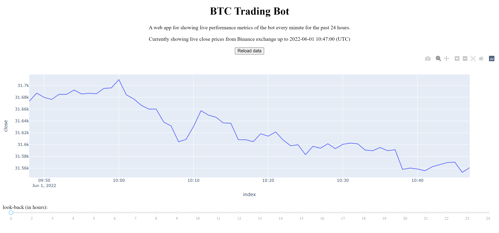

# Data Visualisation Web App

> A web app for visualising data from a database

 

## Table of Contents

- [General Info](#general-information)  
- [Technologies Used](#technologies-used)  
- [Screenshots](#screenshots)  
- [Contact](#contact)

 
 

## General Information
This repository contains the source code of the data visualisation web app. The data visualisation web app is hosted
on AWS EC2 and runs in Docker containers. The web app features interactive graphs plotting data stored on a database. 

The database is updated with live data via a separate service. The latest data is always available for the web app.

The current functionality of the web app is to visualise bitcoin prices on 1 minute intervals over the past 24 hours.
Prices are from Binance exchange. For example, this data could be used as input for cryptocurrency trading bot.

 

## Technologies Used
This tool was created in python and the source code may be used as a template for implementing the following libraries 
and frameworks.

| Language    | GUI Framework | Database Framework | Application Environment |
|-------------|---------------|--------------------|-------------------------|
| Python 3.7  | Dash          | SQLite             | Docker                  |

 

## Screenshots
Web App  

 

## Contact
Created by [@LiamRichardson](https://www.linkedin.com/in/liam-richardson/)
 
